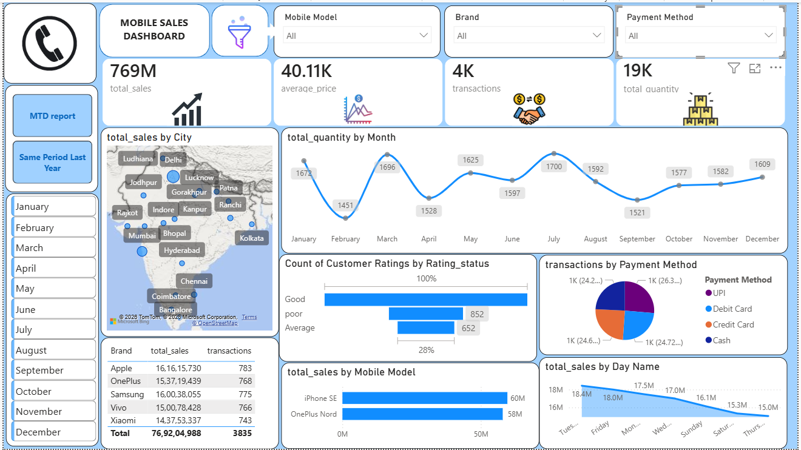

# 📱 Mobile Sales Dashboard | Power BI

## Project Overview

This project presents an interactive Mobile Sales Dashboard built in Power BI. The dashboard helps analyze mobile sales performance across different brands, cities, payment methods, and customer ratings through dynamic visualizations and filters.

The objective of this project is to transform raw sales data into meaningful business insights that support data-driven decision-making.

---

## Dashboard Preview



---

## Key Performance Indicators

- Total Sales: 167M
- Average Price: 41.46K
- Total Transactions: 792
- Total Quantity Sold: 4K

---

## Dashboard Features

### Sales Analysis
- City-wise Sales Distribution
- Monthly Quantity Trend Analysis
- Day-wise Sales Performance
- Mobile Model Sales Analysis

### Customer Insights
- Customer Rating Analysis
- Good, Average, and Poor Rating Distribution

### Payment Analysis
- UPI Transactions
- Debit Card Transactions
- Credit Card Transactions

### Brand Performance
- Brand-wise Revenue Comparison
- Transaction Analysis by Brand

### Interactive Filters
- Mobile Model
- Brand
- Payment Method
- Month Selection

---

## Tools & Technologies Used

- Power BI Desktop
- Power Query
- DAX
- Data Modeling
- Data Visualization

---

## Business Insights

- Identified top-performing cities based on sales revenue.
- Analyzed monthly sales trends and demand patterns.
- Evaluated customer satisfaction through rating analysis.
- Compared brand performance using sales and transaction metrics.
- Analyzed customer payment preferences.

---

## Project Files

```text
Mobile-Sales-Dashboard/
│
├── Mobile_Sales_Dashboard.pbix
├── dashboard.png
├── dataset.xlsx
└── README.md
```

---

## Author

**Riya Verma**
